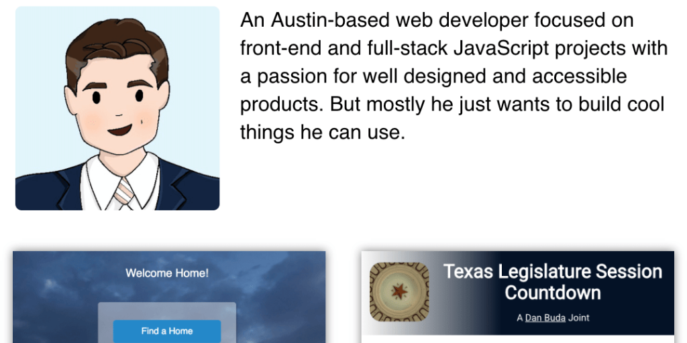

<kbd></kbd>

## Dan Buda's Portfolio

This project is an update to a previous version of my portfolio. While the previous version was functional and looked fine, I wanted to create a new portfolio with a updated version of React and to make use of a custom Webpack framework that I have been developing.

The site is fully responsive and built with a mobile-first mindset.

It's built with:

- React v15 and React Router v4
- Sass with some mixins and CSS transitions, CSS Grid & Flexbox
- A custom Webpack v2 framework that uses hasing code segments and image size limits for faster page loading
- Font Awesome for icons
